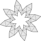
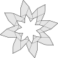
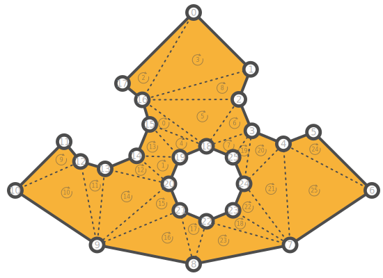
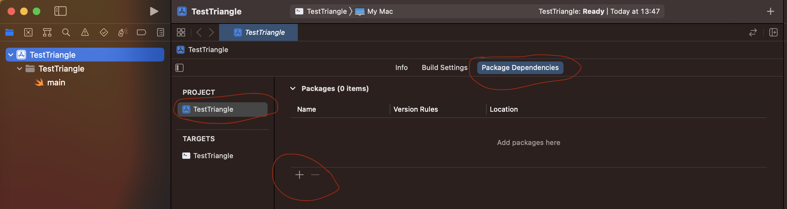
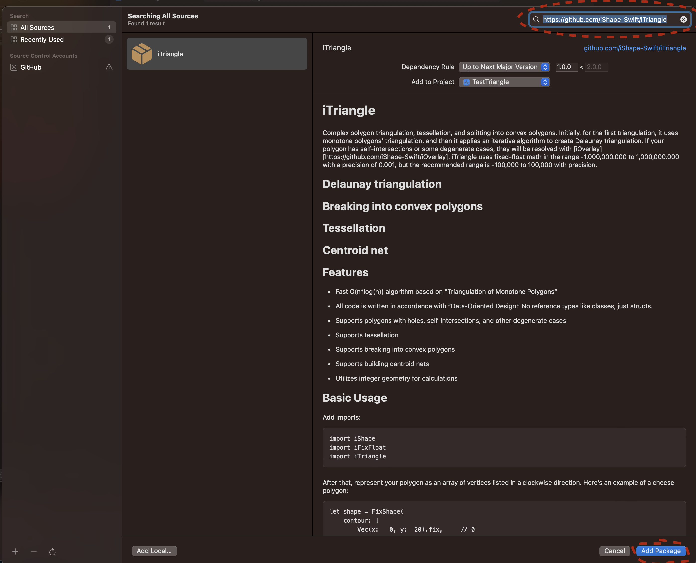

# iTriangle
A fast and efficient library for Delaunay triangulation and converting complex polygons into convex shapes, including advanced self-intersection resolution.
 
## Delaunay triangulation
<p align="center">
  
</p>

## Breaking into convex polygons
<p align="center">
  
</p>

## Features

- **Delaunay Triangulation**: *Efficient and robust implementation for generating Delaunay triangulations.*
- **Convex Polygons**: *Break complex polygons into simpler convex polygons.*
- **Self-Intersection**: *Smart intersection resolution with Even-Odd or Non-Zero rules.*

## Documentation
- [Delaunay](https://ishape-rust.github.io/iShape-js/triangle/delaunay.html)

## Basic Usage

Add imports:
```swift
import iShape
import iFixFloat
import iTriangle
```

After that, represent your polygon as an array of vertices. Here's an example of a cheese polygon:
<p align="center">
 
</p>

```swift
let shape = [
    [
        CGPoint(x:   0, y:  20),     // 0
        CGPoint(x:   8, y:  10),     // 1
        CGPoint(x:   7, y:   6),     // 2
        CGPoint(x:   9, y:   1),     // 3
        CGPoint(x:  13, y:  -1),     // 4
        CGPoint(x:  17, y:   1),     // 5
        CGPoint(x:  26, y:  -7),     // 6
        CGPoint(x:  14, y: -15),     // 7
        CGPoint(x:   0, y: -18),     // 8
        CGPoint(x: -14, y: -15),     // 9
        CGPoint(x: -25, y:  -7),     // 10
        CGPoint(x: -18, y:   0),     // 11
        CGPoint(x: -16, y:  -3),     // 12
        CGPoint(x: -13, y:  -4),     // 13
        CGPoint(x:  -8, y:  -2),     // 14
        CGPoint(x:  -6, y:   2),     // 15
        CGPoint(x:  -7, y:   6),     // 16
        CGPoint(x: -10, y:   8)      // 17
    ],
    [
        CGPoint(x:   2, y:   0),    // 18
        CGPoint(x:  -2, y:  -2),    // 19
        CGPoint(x:  -4, y:  -5),    // 20
        CGPoint(x:  -2, y:  -9),    // 21
        CGPoint(x:   2, y: -11),    // 22
        CGPoint(x:   5, y:  -9),    // 23
        CGPoint(x:   7, y:  -5),    // 24
        CGPoint(x:   5, y:  -2)     // 25
    ]
]

let triangulation = shape.triangulate()

print("points: \(triangulation.points)")
print("indices: \(triangulation.indices)")
```
**Output Triangulation**: *triangles indices and vertices, where all triangles oriented in a clockwise direction.*

## Installation

### [Package Manager](https://swift.org/package-manager/)


Add the following to your `Package.swift`:
```swift
let package = Package(
    name: "[your name]",
    products: [
        dependencies: [
            .package(url: "https://github.com/iShape-Swift/iTriangle", from: "1.10.0")
        ],
        targets: [
            .target(
                name: "[your target]",
                dependencies: ["iTriangle"])
        ]
    ]
)
```
Or add it directly through .xcodeproj


<p align="center">

</p>

In Searchbar add https://github.com/iShape-Swift/iTriangle


